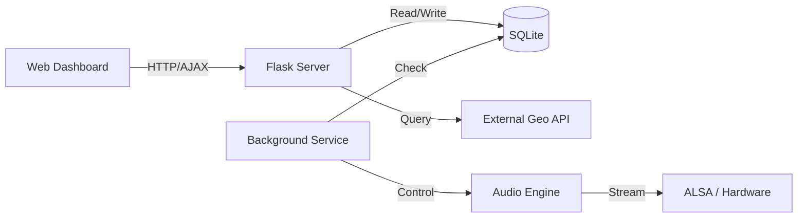

# AnnounceFlow

**Enterprise Automated Broadcast System v1.5.0**

[](https://python.org)
[](https://raspberrypi.org)
[](https://mpg123.de)
[](https://github.com/berkaybakac/announceflow/releases/tag/v1.5.0)

## Overview

AnnounceFlow is a robust, "set-and-forget" IoT audio automation solution designed for commercial environments (retail, manufacturing, corporate). It provides precision scheduling, dynamic background suppression based on external geolocation events, and a secure, user-friendly web management interface.

Designed for stability on Raspberry Pi 4, it survives power outages and maintains strict operational schedules without human intervention.

## Key Features (v1.5.0)

| Feature | Description |
|---------|-------------|
| **Dynamic System Stats** | Real-time disk/RAM monitoring with `get_system_stats()`. Shows actual capacity, not fake "unlimited". |
| **24-Hour Time Format** | Flatpickr integration enforces strict HH:MM format across all time inputs. Turkish locale. |
| **Modern Desktop Agent** | Custom `ModernButton` and `ModernSlider` Canvas widgets for cross-platform UI consistency. |
| **Dynamic Geolocation** | Automatically fetches city/district data via external API for location-based event handling. |
| **Operational Hours** | Configurable start/stop times with Flatpickr time picker. |
| **Advanced Scheduling** | Recurring weekly plans with 24h format and minimum 1-minute intervals. |
| **Enterprise Security** | Double-verification password changes and secure session management. |
| **Priority Audio** | Announcements interrupt background music automatically and resume playback seamlessly. |
| **Media Library** | Support for MP3, WAV, AIFF, M4A with auto-conversion and duration analysis. |

## Technical Architecture



- **Backend:** Python Flask + Waitress (Production Server)
- **Frontend:** HTML5/JS with AJAX for asynchronous data loading
- **Database:** SQLite with automatic schema migration
- **External Data:** Dynamic JSON fetching for 81 provinces & 900+ districts
- **Audio Engine:** `mpg123` driven by `pystray` process management
- **Hardware Integration:** Systemd service on Raspberry Pi OS (Debian Bookworm)

## Installation & Deployment

### Automated Deployment (Raspberry Pi)
The system includes a single-command deployment script that handles all dependencies, service configuration, and file synchronization.

```bash
# On your local machine
./deploy.sh
```
*This script uses `rsync` to push code and `ssh` to configure systemd services, pip requirements, and permissions.*

### Local Development
```bash
git clone <repository_url>
pip install -r requirements.txt
python main.py
# Access at http://localhost:5001
```

## API Reference

The system exposes a RESTful API for integration:

- `GET /api/prayer-times/districts?city=Name` - Fetch districts dynamically
- `POST /api/settings/working-hours` - Configure operational windows
- `GET /api/now-playing` - Live playback status
- `POST /api/play` - Trigger immediate playback

## Configuration

Located in `config.json` (auto-created):
```json
{
    "admin_username": "admin",
    "working_hours_enabled": true,
    "working_hours_start": "09:00",
    "working_hours_end": "22:00",
    "prayer_times_city": "Gaziantep",
    "prayer_times_district": "Sehitkamil"
}
```

## Reliability

- **Power Loss Recovery:** Service auto-starts on boot.
- **Network Resilience:** Caches geolocation data locally; operates offline once configured.
- **Audio Watchdog:** Monitoring ensures audio queue never stalls.

---
© 2026 AnnounceFlow Enterprise Solutions.
